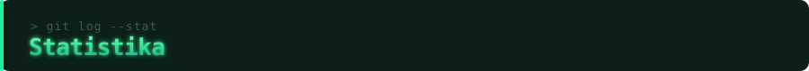

<div align="center">


</div>

<br/>


```python
class MuhammadaminOzadov:
    role     = "Python Backend Developer & Data Analyst"
    location = "O'zbekiston"
    focus    = ["Backend arxitektura", "Data Engineering", "BI tahlil"]

    def daily_work(self) -> str:
        return "API yozish, SQL optimallashtirish, dashboard qurish"
```


<div align="center">


</div>



<div align="center">


</div>


<div align="center">


</div>


<div align="center">

[](mailto:muhammadaminozadov@gmail.com)
[](https://www.linkedin.com/in/muhammadamin-ozadov)
[](https://t.me/Muhammadamin_Ozadov)


</div>
